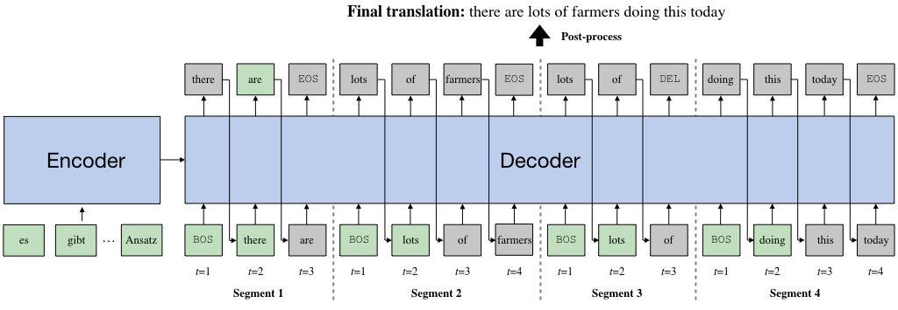

# Learning to Recover from Multi-Modality Errors for Non-Autoregressive Neural Machine Translation

This is the implementation of [Learning to Recover from Multi-Modality Errors for Non-Autoregressive Neural Machine Translation](https://www.aclweb.org/anthology/2020.acl-main.277/). The code is based on [OpenNMT](https://github.com/OpenNMT/OpenNMT-py).

## Introduction

Non-autoregressive neural machine translation (NAT) predicts the entire target sequence simultaneously and significantly accelerates inference process. However, NAT discards the dependency information in a sentence, and thus inevitably suffers from the multi-modality problem: the  target  tokens may be provided by different possible translations, often causing repetitive or missing token errors. To alleviate this problem, we propose a novel NAT model RecoverSAT, which generates a translation  as  a  sequence of segments. The segments are generated simultaneously while each segment is predicted token-by-token. By dynamically determining segment length and deleting redundant segments that semantically overlap with other segments, RecoverSAT is capable of recovering from repetitive and missing token errors.



## Prerequisite

To use this source code, you need Python3.6+. And the python dependencies can be installed as follows:

```
pip install -r requirements.txt
```

## Usage

### Training

To train a Transformer, the following command can be used. `[DATASET]` is the name of the dataset used.

```
python train.py \
    --model_name Transformer \
    --dataset [DATASET] \
    --train_src_file [TRAIN_SRC] \
    --train_tgt_file [TRAIN_TGT] \
    --valid_src_file [VALID_SRC] \
    --valid_tgt_file [VALID_TGT] \
    --vocab_path [VOCAB_PATH]

```

To train a RecoverSAT, you can use the following command. `[INIT_ENCODER_PATH]` is the path where you save the Transformer model. `[DISTILLED_TGT]` is the path of the file containing sentences generated in sequence-level distillation.

```
python train.py \
    --model_name RecoverSAT \
    --segment_num [SEGMENT_NUM] \
    --dataset [DATASET] \
    --init_encoder_path [INIT_ENCODER_PATH] \
    --train_src_file [TRAIN_SRC] \
    --train_tgt_file [DISTILLED_TGT] \
    --valid_src_file [VALID_SRC] \
    --valid_tgt_file [VALID_TGT] \
    --vocab_path [VOCAB_PATH]
```

### Inference

For inference, you can run the following command. `[OUTPUT_FILE]` is the path where to save the predicted sentences.

```
python predict.py \
    --model_path [MODEL_PATH] \
    --input_file [INPUT_FILE] \
    --output_file [OUTPUT_FILE] \
    --vocab_path [VOCAB_PATH]
```

## Citation

```bibtex
@inproceedings{ran2019learning,
  title={Learning to Recover from Multi-Modality Errors for Non-Autoregressive Neural Machine Translation},
  author={Ran, Qiu and Lin, Yankai and Li, Peng and Zhou, Jie},
  booktitle = {Proceedings of the 58th Annual Meeting of the Association for Computational Linguistics},
  year={2020}
}
```